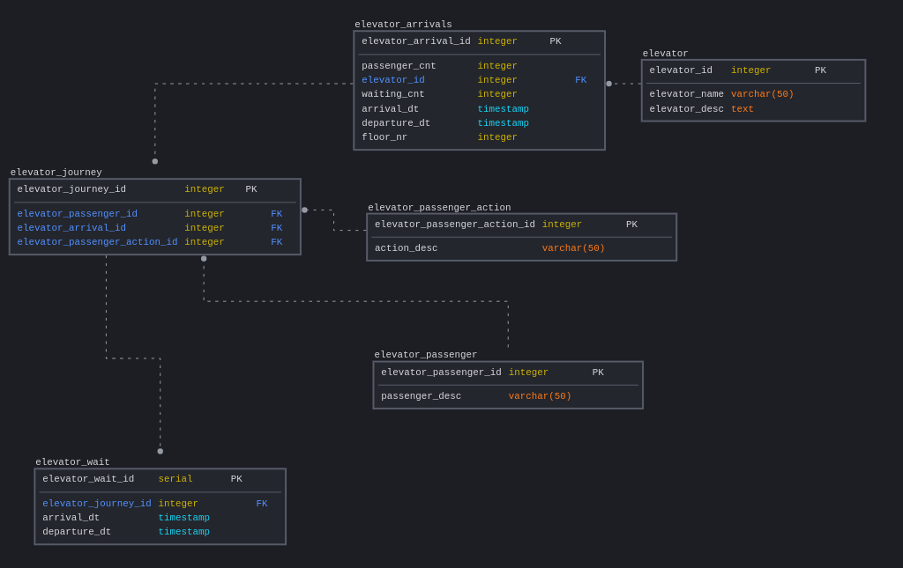

# Seriously data engineer

# 1. Vending machine

## Requirements

- software design for a basic vending machine
- implement the virtual vending machine
- command-line test program to test the vending machine

## Solution

- programming language: Python

- list of items: manually specified inside the code

- test program: command line execution of the Python script

### Specifications

1. Display list of items with prices
2. Ask for input from user - ID of chosen item
3. Ask for input from user - amount of money inserted
4. Display item chosen, calculate returned money

### Possible modifications / TODOs
- item source - read from file/db
- sort items into categories, offer categories first
- sorting items by price / name / id
- adding and removing items
- updating amount of individual items sold

## execution
### Requirements:
    docker

navigate to project directory, from commandline execute following commands:
build docker image:
```
docker build -t serimage .  
```

execute docker container, which runs the script
```
docker run -it -v "/$(pwd)/vending_machine/vending_machine.py:/vending_machine.py" serimage:latest python /vending_machine.py
```


# 1. Elevator data modeling

## Modeling performance of elevators


Model is modified for easier analysis, contains some duplicate data across tables or computable from other table. Raw data doesn't have to contain duplicates, depending on amount of data (e.g. `elevator_wait.departure_dt`,  `elevator_arrivals.passenger_cnt`, `.waiting_cnt`). Given tables can be considered halfway between processed data and computed datamarts.
We assume each person gets a unique identifier per journey.

Dimension tables:
- `elevator`: information about available elevators
- `elevator_passenger`: information about passengers, to be used for journey tracking
- `elevator_passenger_action`: actions available to passengers (enter, leave)

Fact tables:
- `elevator_arrivals`: information on each elevator's movement with time, passengers (passenger count does not have to come from source, can be calculated from `elevator_journey`)
- `elevator_journey`: information about passenger's journey, including arrival at the elevator
- `elevator_wait`: information on passenger arriving to the elevator and waiting, linked to the subsequent elevator ride. Passengers not entering an elevator ride are not observed atm.
## Performance measures
- Average waiting time per passenger
- Average journey time per passenger
- Average elevator load
- Average empty journey time


## Analysis scripts
### Analysis per passenger
#### elevator/analysis/01_analysis_passenger.sql:
- waiting time per passenger, amount of time spent waiting before the lift arrives
- description of trip of each passenger (arrival at the lift, entering and exiting) with details of floor, time

#### elevator/analysis/02_averages.sql:
- average waiting time for lift to arrive for all passengers and lifts, in seconds
- average travelled floors for passengers
- average elevator travel time between making stops